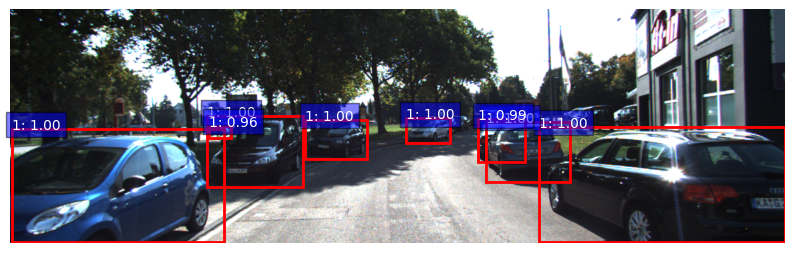
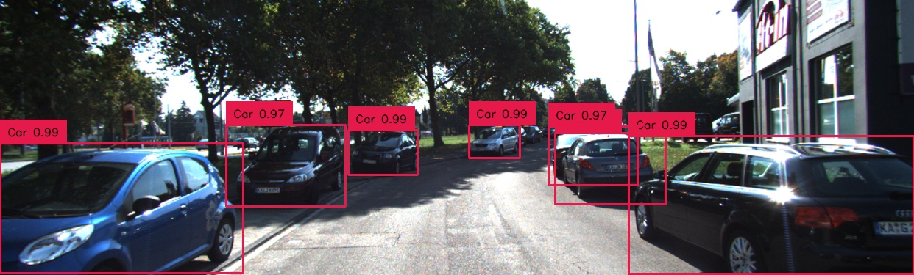

# Faster R-CNN vs. DETR: A Practical Lightweight Benchmark for Real-World Car Detection on KITTI
Car detection project comparing Faster R-CNN and DETR on the KITTI dataset.

## Dataset
- **[KITTI Dataset](https://www.cvlibs.net/datasets/kitti/)**
- Contains images and bounding boxes for cars.

## Model Comparison
| Model        | AP@0.5 | AP@0.75 | Notes                  |
|--------------|--------|---------|------------------------|
| Faster R-CNN | 0.88   | 0.69    | Good on small objects  |
| DETR         | 0.83   | 0.62    | Promising results      |

**Read the full article [here](https://medium.com/@monishatemp20/faster-r-cnn-vs-detr-a-practical-lightweight-benchmark-for-real-world-car-detection-on-kitti-983c714e2da3)**

> Note:
This repo is a modular version of an end-to-end object detection project developed and tested in a Google Colab notebook.

For clarity and presentation purposes, the code has been split across files and folders. You may need to:
- Adjust file paths (e.g., Drive paths to local paths)
- Install dependencies (see `requirements.txt`)
- Provide pretrained models or resume checkpoints

## Sample Predictions

### Faster R-CNN

### DETR

### Faster R-CNN (False positive)

## Author

**Monisha**  
Connect via [Medium](https://medium.com/@monishatemp20)  

---
