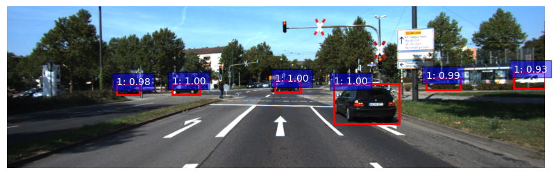
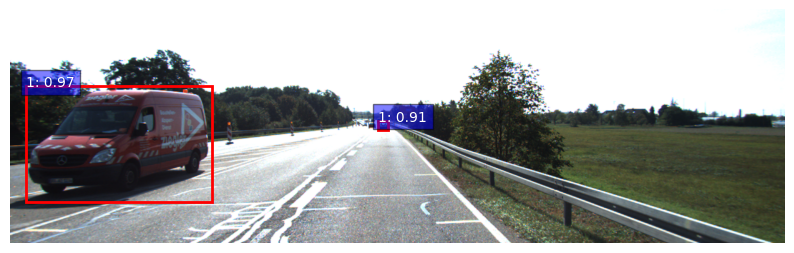

# Benchmarking DETR vs. Faster R-CNN for Real-World Car Detection (KITTI)
Car detection project comparing Faster R-CNN and DETR on the KITTI dataset.

> **Read the full write-up on Medium**:  
> [Benchmarking DETR vs. Faster R-CNN for Real-World Car Detection (KITTI)](https://medium.com/@monishatemp20/faster-r-cnn-vs-detr-a-practical-lightweight-benchmark-for-real-world-car-detection-on-kitti-983c714e2da3)
>
> **For architectures of Faster R-CNN & DETR, read the below articles on Medium:**
>
> [Detection Series 1: Transformers — ViT, DETR](https://medium.com/@monishatemp20/cv-27-transformers-vit-detr-338572699e5c)
>
> [Detection Series 2: DETR vs Faster R-CNN](https://medium.com/@monishatemp20/cv-28-detr-vs-faster-r-cnn-dbdb45ace334)

## Dataset
- **[KITTI Dataset](https://www.cvlibs.net/datasets/kitti/)**
- Contains images and bounding boxes for cars.

## Model Comparison
| Model        | AP@0.5 | AP@0.75 |  AP (Small Objects)   | AP (Large Objects) |Notes                  |
|--------------|--------|---------|-----------------------|--------------------|-----------------------|
| Faster R-CNN | 0.88   | 0.69    | 0.49                  |  0.72              | Good on small objects  |
| DETR         | 0.83   | 0.62    | 0.32                  |  0.72              |Promising results      |
> Note:
This repo is a modular version of an end-to-end object detection project developed and tested in a Google Colab notebook.

## Observation
- Faster R-CNN consistently outperforms DETR in this setup
- The gap is prominent for small objects (AP: 0.49 vs. 0.32) (DETR lacks an FPN or multi-scale feature representation)
- Both models perform equally well on large objects (AP ≈ 0.72), showing DETR can be competitive with enough training

For clarity and presentation purposes, the code has been split across files and folders. You may need to:
- Adjust file paths (e.g., Drive paths to local paths)
- Install dependencies (see `requirements.txt`)
- Provide pretrained models or resume checkpoints

## Sample Predictions

### Faster R-CNN

### DETR

### Faster R-CNN (False positive)

## Author

**Monisha**  
Connect via [Medium](https://medium.com/@monishatemp20)  

---
